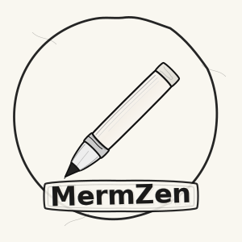
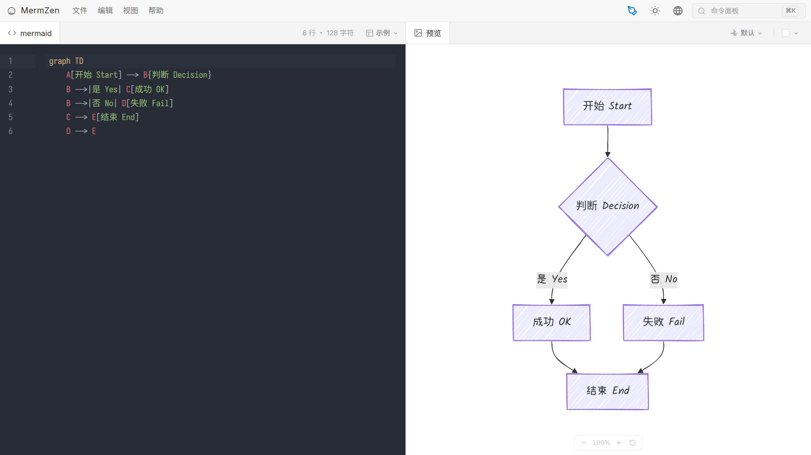
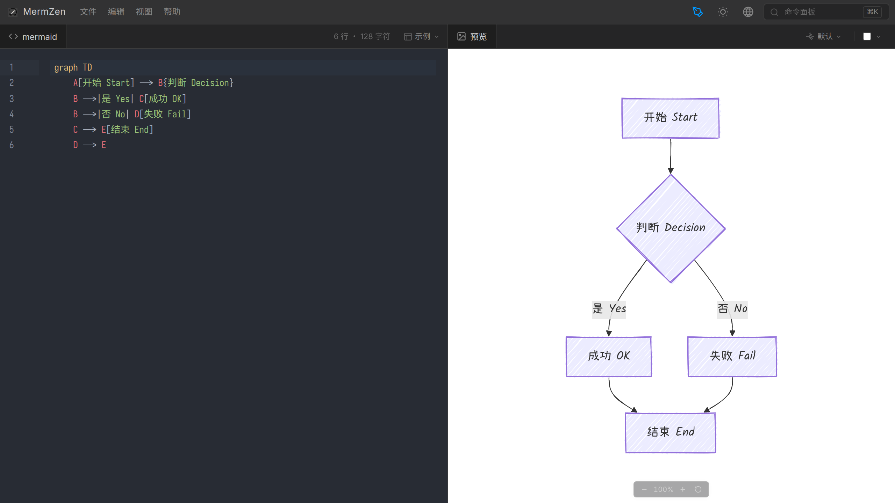
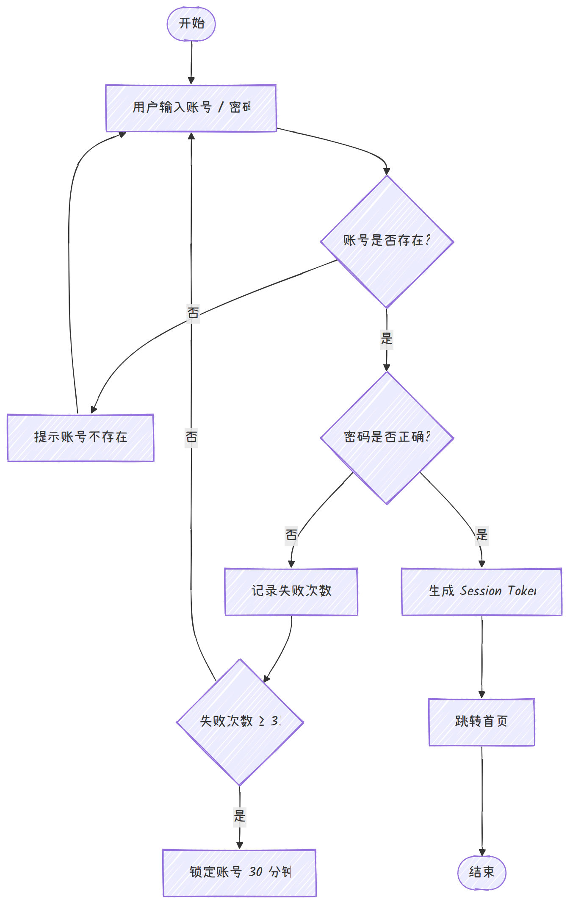
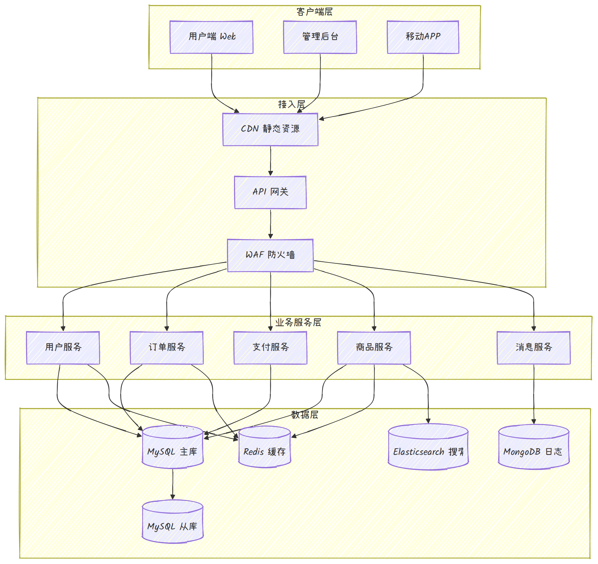
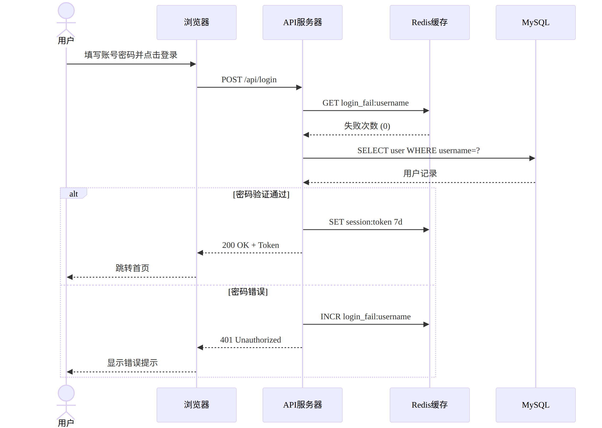

# MermZen

  

**MermZen** 是一款开箱即用的 Mermaid 图表编辑器。打开即写，实时渲染，零干扰。

名字源于 **Mermaid**（图表语法）+ **Zen**（禅），追求极简设计与轻量体验。

**在线体验：[MermZen](https://eric.run.place/MermZen/)**

[English](README.md)

---

## 效果预览

### 编辑器界面

  
  &nbsp;
  

### 功能展示

MermZen 支持丰富的主题和风格组合，轻松满足不同场景需求：

  

    
  

  

    <h4>🎨 <a href="https://eric.run.place/MermZen/#H4sIAAAAAAAAA4WQwU7DMBhF7/sVqk4Q0gO6UKAig4cO3Qp07dJqm1aJtCVLSkX17pS2HcTBnfI43vOe83Bk11LpZqVQo15IatnMkYIYjTCZUK61M41aFZaqxR31xT8a29u52XbQpZ1s9YbUMjMpiSMx1sZtLc4kQzS8u3qRv2qXz90S2l856X02N9H1L2e25hW9TqL9e/2Wz7/LWx9n8k8X8zrP8/yeX8fnP8/rf8/1f8/2f8/3f8/7f8/9f8/8f8//5/8f8//8fAPn8p8f8KAHwAA" target="_blank">手绘风格 + 默认主题</a></h4>
    <ul>
      <li>流畅的手绘线条，自带设计感</li>
      <li>内置中英文手写字体支持</li>
      <li>适合PPT演示、博客插图、个人笔记等场景</li>
      <li>导出的图片和SVG均包含内嵌字体，随处可正常显示</li>
    </ul>
  

  

    <h4>🌲 <a href="https://eric.run.place/MermZen/#H4sIAAAAAAAAA52QXU7DMBiF9/kVM6wRBO0gVJBAgcOHTgU6dOk1TatEmxKlpCR9O9K2DcTBnfI43vOe83Bo11LpZqVQo15IatnMkYIYjTCZUK61M41aFZaqxR31xT8a29u52XbQpZ1s9YbUMjMpiSMx1sZtLc4kQzS8u3qRv2qXz90S2l856X02N9H1L2e25hW9TqL9e/2Wz7/LWx9n8k8X8zrP8/yeX8fnP8/rf8/1f8/2f8/3f8/7f8/9f8/8f8//5/8f8//8fAPn8p8f8KAHwAA?theme=forest&handDrawn=false" target="_blank">标准风格 + 森林主题</a></h4>
    <ul>
      <li>专业清晰的标准线条风格</li>
      <li>森林绿色主题，护眼且美观</li>
      <li>适合技术文档、企业架构图、正式报告等场景</li>
      <li>支持5种官方主题，可自由切换</li>
    </ul>
  

  

    
  

  

    
  

  

    <h4>🧩 <a href="https://eric.run.place/MermZen/#H4sIAAAAAAAAA61TTY/TMBD9K5RXQQgJCQA0gEC6oBqL1ddNlTpLqk90xYbEtluyrEiv99xO2kS7dOGFjJmff9+bN39swYbXSpN6pUqZKkZapzJmGCEUzmVCutTGNRlSWqgU99cU/Gttbuel22KWdbPWm1DIzKYkjMdbGbS3OJEM0vLt6kb9ql8/dEtpfOel9NjfR9S9ntuYVvU6i/Xv9ls+/y1sfZ/JPF/M6z/P8nl/H5z/P63/P9X/P9n/P93/P+3/P/X/P/H/P/+f/H/P//HwD5/KfH/CgB8AAA==?bg=grid" target="_blank">手绘风格 + 网格背景</a></h4>
    <ul>
      <li>网格背景便于对齐和比例参考</li>
      <li>支持白色、黑色、透明、网格四种背景</li>
      <li>导出时可自由选择背景类型</li>
      <li>网格背景仅在预览和导出时显示，不影响SVG本身的透明背景</li>
    </ul>
  

<em>💡 点击标题即可在线编辑对应图表，可自由切换风格和主题</em>

---

## 为什么做 MermZen

Mermaid 官方编辑器越来越臃肿：AI 推荐、会员弹窗、冗余面板占满屏幕。你只想写几行代码看个图，却要先绕过一堆干扰。

MermZen 回归本质：基于 CodeMirror 6，支持语法高亮、自动补全、行级错误提示；图表编码在 URL hash 中，分享无需后端、无需账号、链接永久有效。

---

## 主要功能

**编辑器**
- CodeMirror 6 编辑器，Mermaid 语法高亮与自动补全
- 行级错误提示，快速定位问题
- 代码格式化与命令面板（`Ctrl+K`）
- 完整快捷键支持

**预览**
- 实时渲染（300ms 防抖）
- 支持 11 种图表：流程图、时序图、类图、甘特图、饼图、思维导图、ER 图、状态图、架构图、Git 图、块图
- 缩放、平移、棋盘格背景
- 右键菜单快速导出

**输出**
- 导出 SVG 或 PNG（2× 分辨率）
- 复制 PNG 到剪贴板
- URL 分享——图表编码在 hash 中，无需服务器
- iframe 嵌入——通过 `embed.html` 嵌入任何网页

**外观**
- 手绘风格（含中文手写字体）
- 5 种 Mermaid 主题 + 深色/浅色 UI

**引导**
- 内置示例模板
- 交互式新手教程

---

## 快捷键

| 操作 | 快捷键 |
| --- | --- |
| 保存（选择格式） | `Ctrl+S` |
| 复制 PNG | `Ctrl+Shift+C` |
| 格式化代码 | `Ctrl+Shift+F` |
| 命令面板 | `Ctrl+K` |
| 文件/编辑/视图/帮助 | `Alt+F/E/V/H` |
| 切换预览背景 | `Alt+1/2/3/4` |

## 技术栈

- [Vite 7](https://vitejs.dev/) — 构建工具与开发服务器
- [TypeScript](https://www.typescriptlang.org/) — 类型安全
- [Mermaid 11](https://mermaid.js.org/) — 图表渲染引擎
- [CodeMirror 6](https://codemirror.net/) — 代码编辑器
- [SVGO](https://github.com/svg/svgo) — SVG 优化
- [pako](https://github.com/nodeca/pako) — URL 压缩

所有依赖本地打包，运行时零 CDN 依赖。

