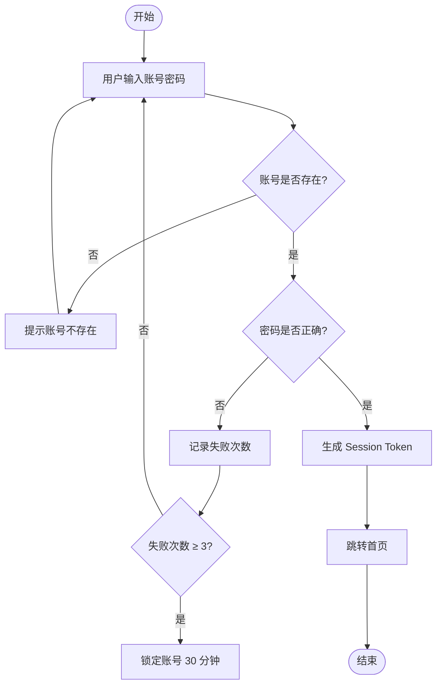
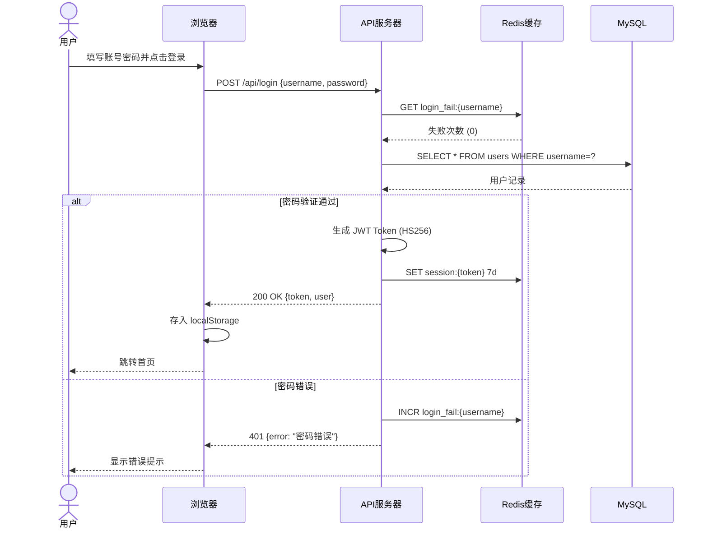
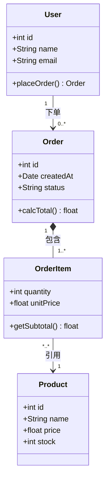
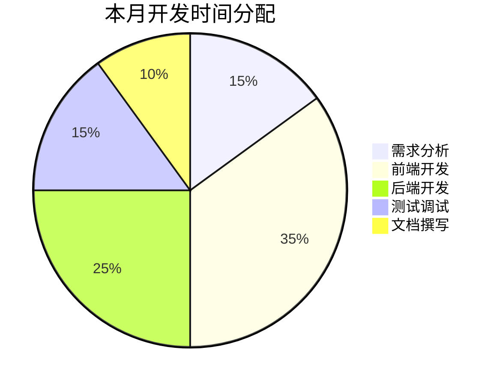
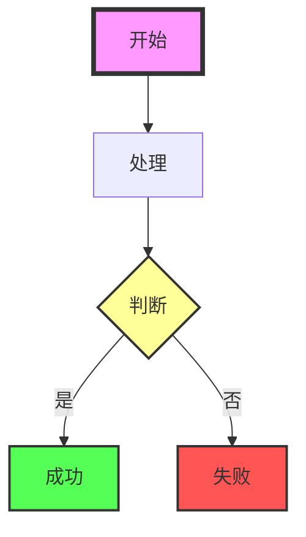
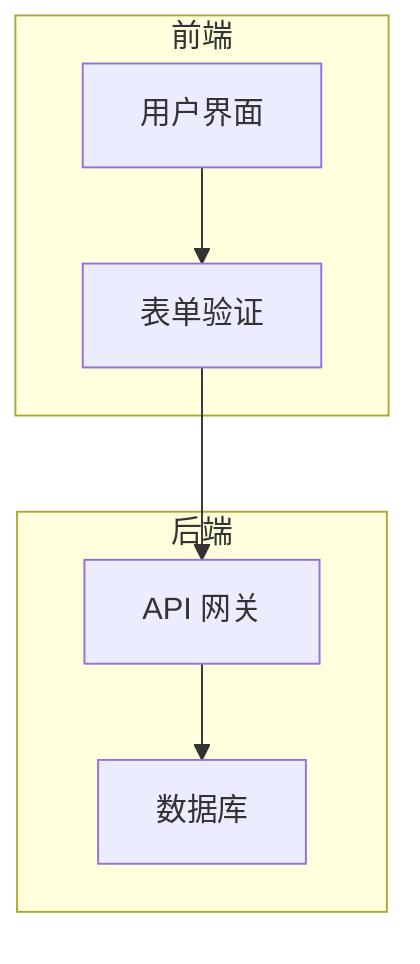
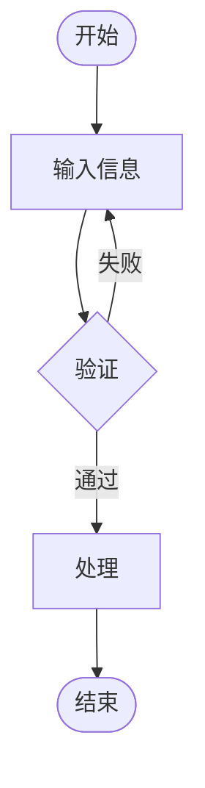

# 【强烈推荐】Mermaid 图表完全教程：从入门到精通，轻量工具 MermZen 助力高效绘图

## 引言

在技术文档、博客文章、项目报告中，图表是传递复杂信息的最佳工具之一。Mermaid 作为一种基于文本的图表绘制语言，让你通过简单的语法就能生成专业美观的图表，无需复杂的绘图工具。

提到 Mermaid 工具，很多人会想到官方的 mermaid.live，它提供了基础的在线编辑和预览功能。但今天我要向大家推荐一款更轻量、更优雅的 Mermaid 在线工具——**MermZen**（https://eric.run.place/MermZen）。

## MermZen 与 mermaid.live 的对比

在众多 Mermaid 在线工具中，mermaid.live 和 MermZen 是两个最受欢迎的选择。让我们看看它们的主要区别：

### mermaid.live（官方工具）
- 功能全面，支持所有 Mermaid 图表类型
- 界面简洁但略显单调，缺乏设计感
- 适合专业开发者使用，功能丰富但操作稍复杂
- 有官方文档支持，但学习曲线较陡

### MermZen（推荐工具）
- **超轻量**：无广告、无多余功能，专注于核心需求，加载速度极快
- **手绘风格**：独有的手绘风格导出功能，让图表更具亲和力和艺术感
- **极简设计**：界面美观优雅，操作简单直观，新手也能快速上手
- **实时预览**：输入代码即可看到效果，支持一键导出高质量图片
- **无需安装**：完全在线使用，访问即得，无需配置任何环境

如果你想要一个快速、简单、美观的 Mermaid 编辑工具，MermZen 绝对是你的首选！

**立即体验 MermZen：** https://eric.run.place/MermZen

## 关于 Mermaid 语法渲染说明

本博客中展示的部分 Mermaid 图表可能无法在 CSDN 博客页面上正常渲染，这可能是由于 CSDN 支持的 Mermaid 语法版本较旧导致的。

**解决方法：**
1. 使用专业的 Mermaid 在线工具渲染，推荐使用 MermZen（https://eric.run.place/MermZen）
2. 在 MermZen 中输入代码即可实时预览并导出高质量图片
3. 将导出的图片直接插入到博客文章中

## Mermaid 语法入门

### 1. 流程图（Flowchart）

流程图是最常用的图表类型，用于描述流程步骤和决策路径。

**代码示例：**
```
graph TD
    A([开始]) --> B[用户输入账号密码]
    B --> C{账号是否存在?}
    C -->|否| D[提示账号不存在]
    D --> B
    C -->|是| E{密码是否正确?}
    E -->|否| F[记录失败次数]
    F --> G{失败次数 ≥ 3?}
    G -->|是| H[锁定账号 30 分钟]
    G -->|否| B
    E -->|是| I[生成 Session Token]
    I --> J[跳转首页]
    J --> K([结束])
```

**预览效果：**


**语法要点：**
- 使用 `graph` 关键字声明流程图
- 方向参数：TD（从上到下）、LR（从左到右）
- 节点形状：`A[文字]` 方形，`A{文字}` 菱形（判断），`A([文字])` 圆形（开始/结束）
- 连线类型：`-->`, `-.->`, `==>` 等

### 2. 时序图（Sequence Diagram）

时序图用于描述系统之间的交互顺序。

**代码示例：**
```
sequenceDiagram
    actor 用户
    participant 浏览器
    participant API服务器
    participant Redis缓存
    participant MySQL

    用户->>浏览器: 填写账号密码并点击登录
    浏览器->>API服务器: POST /api/login {username, password}

    API服务器->>Redis缓存: GET login_fail:{username}
    Redis缓存-->>API服务器: 失败次数 (0)

    API服务器->>MySQL: SELECT * FROM users WHERE username=?
    MySQL-->>API服务器: 用户记录

    alt 密码验证通过
        API服务器->>API服务器: 生成 JWT Token (HS256)
        API服务器->>Redis缓存: SET session:{token} 7d
        API服务器-->>浏览器: 200 OK {token, user}
        浏览器->>浏览器: 存入 localStorage
        浏览器-->>用户: 跳转首页
    else 密码错误
        API服务器->>Redis缓存: INCR login_fail:{username}
        API服务器-->>浏览器: 401 {error: "密码错误"}
        浏览器-->>用户: 显示错误提示
    end
```

**预览效果：**


**语法要点：**
- 使用 `sequenceDiagram` 关键字声明
- `participant` 声明参与者，`actor` 声明用户角色（小人图标）
- 消息样式：`->>`（同步请求），`-->>`（同步响应），`-)`（异步消息）
- 控制结构：`loop`（循环）、`alt/else`（条件分支）、`opt`（可选操作）、`par`（并行操作）

### 3. 甘特图（Gantt Chart）

甘特图用于展示项目任务的时间安排和依赖关系。

**代码示例：**
```
gantt
    title MermZen 博客功能 v1.0 计划
    dateFormat YYYY-MM-DD
    excludes weekends

    section 需求与设计
    需求评审        : done,   req,    2026-03-01, 2d
    UI 原型设计     : done,   ui,     after req,  3d
    设计评审        : milestone,      after ui,   0d

    section 开发
    博客模板开发    : active, tpl,    after ui,   4d
    文章内容编写    :         art,    after ui,   6d
    Actions CI 配置 :         ci,     after tpl,  2d

    section 测试与上线
    功能测试        : crit,   test,   after ci,   3d
    性能检查        : crit,           after test, 1d
    正式上线        : milestone,      after 性能检查, 0d
```

**预览效果：**
```mermaid
gantt
    title MermZen 博客功能 v1.0 计划
    dateFormat YYYY-MM-DD
    excludes weekends

    section 需求与设计
    需求评审        : done,   req,    2026-03-01, 2d
    UI 原型设计     : done,   ui,     after req,  3d
    设计评审        : milestone,      after ui,   0d

    section 开发
    博客模板开发    : active, tpl,    after ui,   4d
    文章内容编写    :         art,    after ui,   6d
    Actions CI 配置 :         ci,     after tpl,  2d

    section 测试与上线
    功能测试        : crit,   test,   after ci,   3d
    性能检查        : crit,           after test, 1d
    正式上线        : milestone,      after 性能检查, 0d
```

**语法要点：**
- 使用 `gantt` 关键字声明
- `dateFormat` 定义日期格式
- `section` 用于任务分组
- 任务语法：`任务名 : 开始日期, 持续天数`
- 依赖关系：`after 任务名`

### 4. 类图（Class Diagram）

类图用于描述面向对象的系统结构。

**代码示例：**
```
classDiagram
    class User {
        +int id
        +String name
        +String email
        +placeOrder() Order
    }

    class Order {
        +int id
        +Date createdAt
        +String status
        +calcTotal() float
    }

    class OrderItem {
        +int quantity
        +float unitPrice
        +getSubtotal() float
    }

    class Product {
        +int id
        +String name
        +float price
        +int stock
    }

    User "1" --> "0..*" Order : 下单
    Order "1" *-- "1..*" OrderItem : 包含
    OrderItem "*..*" --> "1" Product : 引用
```

**预览效果：**


**语法要点：**
- 使用 `classDiagram` 关键字声明
- `class` 定义类，支持属性和方法
- 访问修饰符：`+`（public）、`-`（private）、`#`（protected）
- 关系类型：`<|--`（继承）、`*--`（组合）、`o--`（聚合）、`-->`（关联）
- 多重性标注：`"1" --> "0..*"`

### 5. 饼图（Pie Chart）

饼图用于展示各部分占总体的比例。

**代码示例：**
```
pie title 本月开发时间分配
    "需求分析" : 15
    "前端开发" : 35
    "后端开发" : 25
    "测试调试" : 15
    "文档撰写" : 10
```

**预览效果：**


**语法要点：**
- 使用 `pie` 关键字声明
- `title` 定义图表标题
- 扇区语法：`"名称" : 数值`（数值为相对比例）

## Mermaid 高级技巧

### 1. 自定义样式

Mermaid 支持通过 CSS 自定义图表样式，让你的图表更具个性：

**代码示例：**
```
graph TD
    A[开始]:::startClass --> B[处理]
    B --> C{判断}:::decisionClass
    C -->|是| D[成功]:::successClass
    C -->|否| E[失败]:::failClass

    classDef startClass fill:#f9f,stroke:#333,stroke-width:4px;
    classDef decisionClass fill:#ff9,stroke:#333,stroke-width:2px;
    classDef successClass fill:#5f5,stroke:#333,stroke-width:2px;
    classDef failClass fill:#f55,stroke:#333,stroke-width:2px;
```

**预览效果：**


### 2. 子图分组

使用 `subgraph` 将相关节点分组，提高图表可读性：

**代码示例：**
```
graph TD
    subgraph 前端
        A[用户界面] --> B[表单验证]
    end
    subgraph 后端
        C[API 网关] --> D[数据库]
    end
    B --> C
```

**预览效果：**


### 3. 手绘风格导出

在 MermZen 中，你可以一键导出成手绘风格的图片，让图表更具亲和力：

**代码示例：**
```
graph TD
    A([开始]) --> B[输入信息]
    B --> C{验证}
    C -->|通过| D[处理]
    C -->|失败| B
    D --> E([结束])
```

**预览效果：**


**注意：** 手绘风格效果需要在 MermZen 中导出才能看到最佳效果。

### 4. 导出高质量图片

MermZen 支持导出高质量的 SVG 和 PNG 图片，满足不同场景的需求：
- **SVG 格式**：适合插入文档、网页，支持无限放大
- **PNG 格式**：适合分享、打印，支持手绘风格

### 5. 实时协作

MermZen 支持通过链接分享图表，让团队成员实时协作：
1. 在 MermZen 中创作图表
2. 点击分享按钮生成链接
3. 分享链接给团队成员
4. 团队成员可以在浏览器中查看和编辑图表

## 在 MermZen 中使用 Mermaid

1. 访问 https://eric.run.place/MermZen
2. 在左侧输入 Mermaid 代码
3. 右侧实时预览效果
4. 点击右上角按钮导出图片

就是这么简单！

## 总结

Mermaid 是一款非常强大的图表绘制工具，通过文本语法就能生成专业美观的图表。而 MermZen 则是 Mermaid 工具中的一颗新星，以其轻量、美观、易用的特点，成为开发者的首选工具。

无论你是要写技术文档、博客文章，还是做项目报告，Mermaid 和 MermZen 都是你不可或缺的好帮手。

**立即体验 MermZen：** https://eric.run.place/MermZen

---

希望这篇教程能帮助你快速上手 Mermaid 图表绘制。如果你有任何问题或建议，欢迎在评论区留言！